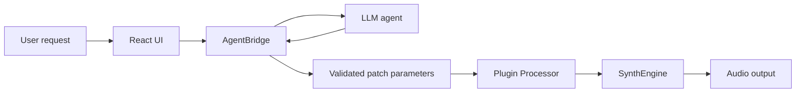

# Agentic Synth Architecture

## Purpose

This document is the canonical architecture reference for Agentic Synth. It describes the target production architecture, the major source directories, the intended data flow, and the architectural decisions that guide future implementation.

Agentic Synth is a VST3/AU plugin and standalone application that uses LLM agents to generate synthesizer patches from natural-language requests. A producer describes a sound, the agent converts that intent into safe patch parameters, and the audio engine renders the result in real time.

## System Overview

Agentic Synth has four primary runtime layers:

| Layer | Primary technology | Responsibility |
| --- | --- | --- |
| Plugin host integration | C++20, JUCE 7 | Expose Agentic Synth as VST3, AU, and standalone targets; own DAW-facing audio and MIDI callbacks. |
| Audio engine | C++20 | Render synth voices, apply patch parameters, and maintain real-time audio safety. |
| Agent bridge | C++ with Python/LLM integration boundary | Translate user requests into structured patch-generation work and move generated patches back into C++. |
| User interface | React, TypeScript, Vite | Provide the companion interface for prompt input, patch review, parameter editing, and future agent interaction. |

The production system keeps LLM inference and all blocking work outside the real-time audio callback. The audio thread consumes already-validated patch state and must never call Python, allocate unbounded memory, perform network I/O, or wait on agent responses.



## Core Components

### SynthEngine

`SynthEngine` is the C++ synthesis core under `src/engine/`. It is responsible for turning validated patch parameters into audio samples.

Target responsibilities:

- Maintain the DSP graph for oscillators, filters, envelopes, modulation, effects, and voice management.
- Render audio deterministically for the sample rate and block size provided by the plugin processor.
- Apply parameter updates through real-time-safe mechanisms such as atomics, lock-free queues, or double-buffered patch state.
- Enforce DSP-level parameter limits as a final safety boundary.

Current repository status:

- `src/engine/SynthEngine.h` and `src/engine/SynthEngine.cpp` contain the placeholder engine surface.
- The placeholder implementation returns silence and establishes the namespace and source location for future DSP work.

### AgentBridge

`AgentBridge` is the boundary between the C++ plugin/application and the agent runtime under `src/agent/`.

Target responsibilities:

- Accept natural-language patch requests and refinement requests from the UI or plugin layer.
- Invoke the selected LLM agent runtime through a C++/Python bridge or local process boundary.
- Require structured agent output, preferably a versioned patch schema rather than free-form text.
- Validate, clamp, and normalize patch parameters before they can reach the audio engine.
- Return agent status, progress, errors, and generated patch metadata to the UI.

Current repository status:

- `src/agent/AgentBridge.h` and `src/agent/AgentBridge.cpp` contain the placeholder bridge surface.
- `third_party/README.md` reserves `third_party/llama.cpp/` for local model inference dependencies.

### React UI

The React UI lives under `ui/` and is built with Vite-oriented project structure.

Target responsibilities:

- Capture typed and, eventually, spoken sound-design requests.
- Display agent responses, generated patches, and refinement history.
- Provide direct controls for patch parameters so users can override or fine-tune agent output.
- Visualize audio and patch state through waveform, spectrum, envelope, modulation, and preset views.
- Communicate with the C++ application/plugin boundary through a defined local API or embedded web-view bridge.

Current repository status:

- `ui/src/App.tsx` contains a placeholder UI shell.
- `ui/package.json` currently exposes linting through `npm run lint`.

### Plugin Processor

The plugin processor is the DAW-facing C++ component under `src/PluginProcessor.*`.

Target responsibilities:

- Implement JUCE `AudioProcessor` lifecycle hooks for preparation, state restoration, MIDI handling, audio rendering, and editor creation.
- Own the real-time `processBlock` callback and delegate synthesis to `SynthEngine`.
- Receive validated parameter updates from the agent/UI side without blocking the audio callback.
- Serialize plugin state for DAW sessions, including generated patch parameters and user edits.

Current repository status:

- `src/PluginProcessor.cpp` currently clears the output buffer as a placeholder.
- `src/PluginEditor.*` contains the JUCE editor surface for the plugin target.

## Data Flow

The main product loop is natural language to audio:

1. The user enters a request such as `make a dark evolving pad with slow motion` in the React UI or plugin editor.
2. The UI sends the request to `AgentBridge` using the local integration channel.
3. `AgentBridge` prepares a constrained prompt or structured request for the LLM agent.
4. The LLM returns a structured patch proposal with oscillator, filter, envelope, modulation, and effects parameters.
5. `AgentBridge` validates the patch schema, clamps unsafe values, fills defaults, and converts the result into the internal patch representation.
6. The plugin processor receives the validated patch update through a real-time-safe handoff.
7. `SynthEngine` applies the patch at a safe synchronization point and renders audio in `processBlock`.
8. The user hears the result and can refine it with another prompt or direct UI edits.

```text
user request
  -> AgentBridge
  -> LLM agent
  -> patch parameters
  -> validation and normalization
  -> Plugin Processor
  -> SynthEngine
  -> audio output
```

Key boundaries:

- The LLM path is asynchronous and non-real-time.
- Patch validation happens before parameters reach `SynthEngine`.
- The audio callback only reads prepared state and renders audio.
- UI updates and audio rendering use separate timing models.

## Build System

Agentic Synth uses a split build system appropriate for a native audio plugin with a web-based companion UI.

### C++ Plugin and App

- CMake is the top-level build system.
- The project targets C++20.
- JUCE 7 is the selected framework for plugin and standalone application integration.
- `src/CMakeLists.txt` defines the intended JUCE targets for the shared engine library, standalone app, and plugin target.
- `CMakePresets.json` defines local presets for Linux, macOS, and Windows-oriented builds.
- CI configures CMake, builds the project, and runs CTest on Linux, macOS, and Windows.

Important targets and concepts:

- `agentic_synth_engine`: shared C++ engine and agent bridge library.
- `AgenticSynth`: standalone JUCE GUI application target.
- `AgenticSynth_Plugin`: JUCE plugin target configured for VST3, AU, and standalone formats.

### React UI

- The UI lives in `ui/`.
- Vite project files are present in `ui/vite.config.ts`, `ui/tsconfig.json`, and `ui/index.html`.
- React source lives under `ui/src/`.
- Node.js 20 or newer is expected for local development and CI.
- UI linting runs with `npm run lint` from the `ui/` directory.

## Directory Structure

```text
agentic-synth/
  .github/workflows/       CI definitions
  cmake/                   Shared CMake project options and helpers
  docs/                    Architecture documents, diagrams, generated artifacts, and ADRs
  docs/adr/                Architecture Decision Records
  src/                     C++ application, plugin, engine, and bridge code
  src/agent/               AgentBridge C++ boundary
  src/engine/              SynthEngine DSP boundary
  tests/                   C++ test targets
  third_party/             Reserved vendored dependencies and submodules
  third_party/JUCE/        Expected JUCE framework dependency
  third_party/llama.cpp/   Expected local inference dependency
  ui/                      React, TypeScript, and Vite UI project
  CMakeLists.txt           Root CMake entry point
  CMakePresets.json        Local configure and build presets
  CONTRIBUTING.md          Contributor workflow and standards
  README.md                Project overview
```

## Key Design Decisions

Architecture decisions are recorded as ADRs in `docs/adr/`.

| ADR | Status | Decision |
| --- | --- | --- |
| [ADR-0001](adr/ADR-0001-initial-architecture.md) | Accepted | Use JUCE 7 as the audio plugin framework. |

Current guiding decisions:

- Use JUCE 7 for cross-platform VST3/AU plugin and standalone app delivery.
- Keep the audio thread isolated from agent inference, Python execution, file I/O, and network I/O.
- Treat agent output as untrusted until it passes schema validation and parameter clamping.
- Keep the synthesis engine in C++ for deterministic low-latency rendering.
- Use React and Vite for the companion UI to support a richer chat and patch-editing experience than a purely native control panel.
- Prefer local/offline inference where possible so patch generation can work without cloud availability and avoid sending creative session data to external services by default.

## Development Workflow

### Local Setup

Install the expected toolchain:

- CMake 3.24 or newer.
- A C++20-capable compiler.
- JUCE 7 available through the expected third-party location or future dependency bootstrap flow.
- Node.js 20 or newer and npm for UI work.
- Python 3 and `pre-commit` for repository hooks.

Set up hooks:

```sh
python -m pip install pre-commit
pre-commit install --install-hooks
pre-commit install --hook-type commit-msg
```

Build and test C++ code:

```sh
cmake -S . -B build -DAGENTIC_SYNTH_BUILD_TESTS=ON
cmake --build build --parallel
ctest --test-dir build --output-on-failure
```

Lint UI code:

```sh
cd ui
npm ci
npm run lint
```

Run all pre-commit checks before review:

```sh
pre-commit run --all-files
```

### Change Guidelines

- Keep real-time audio code small, deterministic, and allocation-free in `processBlock`.
- Add tests around patch validation, parameter mapping, and any deterministic DSP behavior.
- Update or add ADRs when a change introduces a durable architectural decision.
- Update this document when component ownership, build targets, data flow, or repository structure changes.
- Keep generated documentation artifacts separate from canonical markdown sources.

## Open Architecture Work

The repository currently contains placeholder implementations for the engine, bridge, plugin rendering path, and UI shell. The next architecture milestones are:

- Define the versioned patch parameter schema shared by the agent bridge, UI, plugin state, and `SynthEngine`.
- Decide the concrete C++/Python or local process integration model for agent execution.
- Implement a real-time-safe patch handoff between `AgentBridge`, `PluginProcessor`, and `SynthEngine`.
- Wire the CMake root project to the intended JUCE plugin/app targets as the plugin build matures.
- Expand tests beyond the placeholder target to cover engine behavior and agent-output validation.
