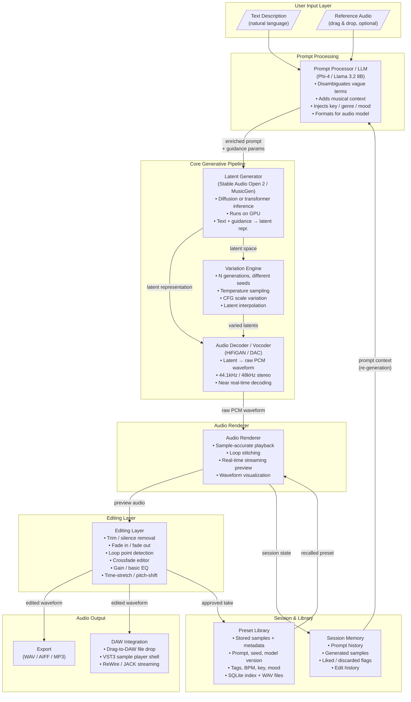

# Agentic Synth — Option 2: Text-to-Audio Synthesis (Direct Waveform Generation)

## High-Level Architecture Document

---

## 1. Overview

### The Fundamental Shift

Option 1 (text-to-parameters) uses an LLM to translate a natural-language sound description into synthesizer control parameters — oscillator tuning, filter cutoffs, envelope times, LFO routing — which then drive a conventional synthesis engine. The architecture is: **text → synth parameters → synth engine → audio**.

Option 2 eliminates the synthesis engine entirely. The model doesn't configure an instrument. It **renders the audio waveform directly from the description**. There are no oscillators. No filter envelopes. No LFO routing tables. The model has internalized what "dark and ominous" or "earthquake vibration" sounds like and produces raw PCM samples.

Architecture: **text → generative audio model → waveform**.

### Why This Matters

A traditional synthesizer is a formal system: its parameter space is bounded and its vocabulary is technical (`filter_cutoff = 800Hz`, `osc1_wave = sawtooth`). A producer who says *"sounds like the floor is about to collapse but in a musical way"* cannot express that in synth parameters without first translating it internally to a technical specification.

The text-to-audio approach accepts the description as-is. The model has learned the mapping from human-expressive language to perceptual audio qualities by training on vast corpora of audio paired with descriptions. The producer's mental model is the interface.

### Tradeoffs vs Option 1

| Dimension | Option 1 (Text → Parameters) | Option 2 (Text → Waveform) |
|---|---|---|
| Precision | High — exact Hz, dB, ms | Low — probabilistic |
| Expressiveness | Low — limited to synth vocabulary | High — unlimited natural language |
| Latency | Near-instant (parameter set) | 5–30s per generation |
| Editability | Parametric — tweak any control | Post-hoc — edit rendered audio |
| Hardware req. | CPU-capable | GPU required (6GB+ VRAM) |
| Reproducibility | Exact (same params = same sound) | Near-exact (seed-controlled) |
| Surprise factor | Low | High — model may exceed expectation |

---

## 2. System Architecture Diagram



---

## 3. Component Descriptions

### 3.1 User Input Layer

**Text Description** — free-form natural language. No template, no dropdowns, no required fields. The producer types what they hear in their imagination. Short fragments ("dark bass, earthquake feel"), poetic descriptions, references to existing sounds ("like that Burial sub-bass but evolving"), production directions ("build to a crescendo over 30 seconds") — all valid input.

**Reference Audio (optional)** — a drag-and-drop audio file the user wants the model to match in character, timbre, or energy. The Prompt Processor encodes salient features into the text prompt or uses audio conditioning if the model supports it (Stable Audio supports optional audio prompts).

---

### 3.2 Prompt Processor / LLM

**Role:** Bridge between human expressive language and the precise structured prompts that audio generation models respond well to.

**Model:** Phi-4 (3.8B) or Llama 3.2 8B — small, fast, runs on the same machine as the audio model without competing for VRAM. Can be offloaded to CPU while the audio model runs on GPU.

**What it does:**
- **Disambiguates vague terms** — "dark" → "sub-heavy, low mid-forward, minimal high-frequency content, minor key or atonal"
- **Adds production context** — infers genre, BPM, key, mood from description and adds it explicitly
- **Expands metaphors** — "earthquake vibration" → "low-frequency tremolo/vibrato, rumble in 30–80Hz range, rhythmic amplitude modulation mimicking seismic P-waves"
- **Formats for model** — produces a structured prompt suitable for the latent generator (which expects audio-domain language, not metaphor)
- **Incorporates session memory** — if the user previously generated a related sound, carries that context forward

**Input:** Raw user text (+ optional reference audio features)
**Output:** Enriched prompt string + optional guidance parameters (duration, tempo, key)

---

### 3.3 Latent Generator Model

The **core generative AI** — the component that has learned the mapping between audio descriptions and sound.

**Architecture options:**

| Model | Type | Max Duration | Quality | VRAM | License |
|---|---|---|---|---|---|
| **Stable Audio Open 2** | Latent diffusion (transformer) | 47s stereo | Excellent (sound design) | 8GB | Apache 2.0 |
| **MusicGen (Meta)** | Autoregressive transformer | 30s | Very good (musical) | 6–16GB | CC-BY-NC |
| **AudioLDM 2** | Latent diffusion (U-Net) | ~10s | Good | 8GB | Apache 2.0 |
| **Custom fine-tuned** | Any of above, fine-tuned | Variable | Best for synth sounds | Same | Project-owned |

**Preferred default: Stable Audio Open 2** — open-source (Apache 2.0), trained on FMA (Free Music Archive, CC-licensed audio), excellent at non-musical sound design, generates up to 47 seconds stereo at 44.1kHz.

**What it produces:** A latent tensor — a compressed high-dimensional representation of the audio, not yet a waveform. This passes to the Audio Decoder.

**Guidance:** Classifier-free guidance (CFG) scale controls how strictly the model follows the prompt vs. how creative it is. Lower CFG = more variation, higher = more literal.

---

### 3.4 Audio Decoder / Vocoder

Converts the latent representation to a raw PCM waveform that can be played back.

**Options:**
- **DAC (Descript Audio Codec)** — state-of-the-art, 44.1kHz, high fidelity, fast inference. Used by Stable Audio Open natively. Preferred.
- **HiFiGAN** — fast, battle-tested GAN-based vocoder, slightly lower fidelity at extreme frequencies but near real-time on GPU.
- **EnCodec (Meta)** — pairs naturally with MusicGen models.

**Performance target:** Decode 10 seconds of audio in < 1 second on RTX 3060. This is achievable with DAC on CUDA.

**Output:** Interleaved stereo PCM float32 at 44.1kHz or 48kHz, ready for playback or file write.

---

### 3.5 Variation Engine

Generates N distinct alternatives from the same prompt so the user can select the best take — like getting multiple mic takes in recording.

**Mechanisms:**
- **Seed variation** — same prompt, different random seed. Deterministic given seed (reproducible).
- **Temperature sampling** — vary sampling temperature in the latent diffusion process. Higher temp = more variation.
- **CFG scale sweep** — generate variants at CFG 3, 5, 7. Lower CFG introduces creative deviation from the prompt.
- **Latent interpolation** — if user likes elements from take A and take B, interpolate their latents to produce a blend (experimental).

**UI:** Renders 3–6 variants simultaneously (parallel inference jobs if VRAM allows, sequential otherwise). User auditions and picks or blends.

---

### 3.6 Editing Layer

Minimal post-generation editing so the user doesn't need to open a DAW for basic operations.

**Capabilities:**
- **Trim** — remove silence or unwanted content from start/end
- **Fade in / Fade out** — linear or equal-power curves, adjustable duration
- **Loop point editor** — detect and set loop points for seamless looping; crossfade editor for loop transitions
- **Gain** — clip-level gain adjustment
- **Basic EQ** — high-pass, low-pass, simple shelf EQ (not a full EQ plugin — just correction)
- **Time-stretch** — stretch/compress audio to match a BPM target without pitch change (Rubber Band library or similar)
- **Pitch-shift** — semitone/cent shift without time change

**What it deliberately does NOT do:** Replace a DAW. Complex effects chains, MIDI, arrangement, multi-track mixing — those stay in the DAW. This layer is for preparation and basic refinement only.

---

### 3.7 Audio Renderer

Handles real-time playback within the application.

**Responsibilities:**
- Sample-accurate playback start/stop/loop
- Real-time waveform visualization (rendered in React canvas)
- **Streaming preview** — as the Audio Decoder produces audio, stream the first decoded chunk to the audio output before full generation is complete (reduces perceived latency)
- Loop stitching — seamless loop playback with crossfade at boundary
- Transport controls (play, pause, loop, scrub)

**Backend:** PortAudio (cross-platform) or platform-native audio API (CoreAudio on macOS, WASAPI on Windows). Exposed to the React UI via WebSocket audio streaming or a native module bridge.

---

### 3.8 Session Memory

Ephemeral per-session store that gives the system context across multiple generations within a working session.

**Stores:**
- All prompts issued this session (raw + expanded)
- All generated samples (paths + metadata)
- Liked / discarded / neutral ratings per sample
- Edit operations applied
- Iteration chain — which generations were derived from which prior generation

**Used by:**
- Prompt Processor — carries forward context when user says "make it longer" or "more aggressive" (understands what "it" and "more" refer to)
- Variation Engine — knows which seeds to avoid (already generated) or explore (away from discarded clusters)

**Storage:** In-memory during session. Serialized to SQLite on session save.

---

### 3.9 Preset Library

Persistent long-term storage of approved samples and their full generation metadata.

**Per entry:**
- Audio file (WAV, full quality)
- Raw user prompt
- Expanded prompt (post-Prompt Processor)
- Model name + version
- Seed
- CFG scale
- Generation timestamp
- User-applied tags (freeform)
- Edit history
- BPM, key, duration (extracted or user-set)

**Storage:** SQLite for metadata index, flat filesystem for WAV files. Optional export to a folder structure compatible with DAW sample library browsers (e.g., compatible with Ableton's Places or Logic's Loop Browser via standard folder hierarchy).

---

## 4. Data Flow — End-to-End Walk-Through

### Scenario: "A dark, ominous bass with rhythmic earthquake vibrations"

```
1. USER INPUT
   User types: "a dark, ominous bass that feels large and otherworldly,
   with a syncopated vibrating feel like an earthquake, rhythmic elements
   that come in and out, speeding up and slowing down, building to a crescendo"

2. PROMPT PROCESSOR (Phi-4, local)
   Interprets: bass sound, dark timbre, sub-heavy, large/roomy, alien quality,
   syncopated LFO-like amplitude modulation, tremolo variation in rate,
   dynamic build (crescendo = increasing amplitude + density over time)

   Produces enriched prompt:
   "Deep sub-bass synthesizer, dark and cavernous, 40–80Hz fundamental with
   sparse upper harmonics, slow tremolo modulation (0.5–2Hz) with irregular
   syncopated rhythm, amplitude envelope building from -18dB to 0dB over 20
   seconds, subtle pitch wobble suggesting instability, reverberant space,
   minor/atonal tonality, BPM: free, duration: 20s"

   Guidance params: duration=20s, steps=50, CFG=6.0

3. LATENT GENERATOR (Stable Audio Open 2, GPU)
   Runs diffusion inference: 50 DDIM steps on enriched prompt
   Produces: latent tensor [batch=1, channels=64, time=T]
   Time: ~8–15s on RTX 3060 Ti

4. AUDIO DECODER (DAC, GPU)
   Decodes latent → PCM float32, 44.1kHz stereo, 20 seconds
   Streams first 2s to Audio Renderer before full decode complete
   Time: <2s for full 20s audio

5. AUDIO RENDERER
   Streams first 2 seconds to speakers immediately (user hears preview)
   Full waveform renders in UI as decode completes
   User listens to the 20-second generation

6. USER REFINEMENT
   User types: "make it 30 seconds and build more dramatically,
   the earthquake rhythm should accelerate at the end"

7. PROMPT PROCESSOR (with session context)
   Carries forward previous enriched prompt
   Updates: duration=30s, adds "acceleration of tremolo rate from 0.3Hz
   to 4Hz over final 10 seconds", "amplitude envelope more aggressive
   gain staging in final 8 seconds"

8. LATENT GENERATOR
   Re-runs with updated prompt + same base seed (so character is preserved)
   New latent → Audio Decoder → new 30s waveform

9. USER APPROVES
   Rates take as "liked"
   Trims 2s of silence from start using Editing Layer
   Sets loop points at 0.5s → 28.3s
   Tags: "bass / dark / earthquake / evolving"

10. SAVE TO PRESET LIBRARY
    Writes WAV to filesystem
    Inserts SQLite record: all metadata, prompt, seed, CFG, edit history

11. DAW EXPORT
    User drags from Preset Library into Ableton Live session
    OR: VST3 sample player shell loaded in DAW, loads this preset,
    plays it on MIDI note-on trigger
```

---

## 5. Technology Choices

| Component | Choice | Rationale |
|---|---|---|
| **Core generation model** | Stable Audio Open 2 | Open-weight (Apache 2.0), 44.1kHz stereo, up to 47s, excellent sound design quality, trained on CC-licensed audio |
| **Fallback model** | MusicGen Medium | Better for melodic/harmonic content; pairs with EnCodec decoder |
| **Audio decoder** | DAC (Descript Audio Codec) | Native to Stable Audio Open, fast, high fidelity, 44.1kHz |
| **Prompt LLM** | Phi-4 (3.8B) | Small enough to run on CPU (offloaded from GPU), fast, good instruction following |
| **Prompt LLM fallback** | Llama 3.2 8B (4-bit GGUF) | Stronger reasoning, still fits in 6GB RAM on CPU |
| **Variation** | Seed sweep + CFG sweep | Deterministic, reproducible, no additional model required |
| **Editing** | Rubber Band (time-stretch), libsndfile (I/O) | Best-in-class OSS time-stretching; libsndfile is industry standard |
| **DAW integration** | VST3 sample player (JUCE) | Universal DAW support; JUCE framework handles AU/VST3/CLAP from single codebase |
| **UI** | React + WebSocket | Same stack as Option 1; WebSocket handles real-time audio streaming and waveform data push |
| **Session/preset storage** | SQLite + filesystem WAV | Zero infrastructure, fast queries, portable |
| **Audio I/O** | PortAudio | Cross-platform, low-latency, well-maintained |
| **Local hardware minimum** | RTX 3060 (6GB VRAM) / Apple M2 (16GB unified) | Stable Audio Open 2 requires ~5.5GB VRAM; M2 can run via MPS backend |
| **Local hardware recommended** | RTX 4070 (12GB VRAM) / Apple M3 Max | Enables larger batch sizes (parallel variation generation) |
| **Generation latency target** | < 10s for 10s audio | Achievable on RTX 3060 with Stable Audio Open 2 at 50 steps |
| **Cloud fallback** | Replicate / Modal (Stable Audio API) | For users without capable GPU; adds ~2–5s network latency but removes hardware barrier |

---

## 6. Key Risks & Mitigations

### Risk 1: Generation Latency — Breaks Real-Time Feel

**Problem:** 5–30 seconds per generation on consumer GPU. A producer adjusting a sound expects immediate feedback. Waiting 15 seconds per iteration is workable for deliberate generation but kills the flow state of sound design.

**Mitigations:**
- **Streaming decode** — Audio Decoder streams the first 2 seconds of audio to playback before full generation is complete. User hears something within 2–3 seconds even if the full render takes 15.
- **Background pre-generation** — while user is listening/editing the current take, the Variation Engine pre-generates 2–3 variants in the background with the current seed neighborhood.
- **Cached quick-start presets** — a small library of pre-generated stems for common categories (bass, pad, FX, percussion). User can start playing with these immediately while the custom generation runs.
- **Progressive step streaming** — for diffusion models, output intermediate noisy-but-recognizable versions at step 10, 20, 30, 50 so user can abort early if clearly wrong direction.

---

### Risk 2: Quality Inconsistency

**Problem:** The model may not understand unusual or idiosyncratic descriptions. "Sounds like the floor is about to collapse" might produce an incoherent result.

**Mitigations:**
- **Prompt Processor as buffer** — the LLM translates metaphor into audio-domain language the generative model understands. This is the primary quality improvement lever.
- **User rating feedback loop** — liked/disliked ratings stored per session. Over time, fine-tune the Prompt Processor on (raw_prompt, expanded_prompt, rating) pairs.
- **Fine-tuning on synth/sound-design datasets** — curate a dataset of (description, audio) pairs from sound design libraries, fine-tune Stable Audio Open 2 on this domain. Custom fine-tune dramatically improves performance for the specific vocabulary of electronic music production.
- **Reference audio conditioning** — when the model supports it, a reference audio drop-in steers generation even when text is vague.

---

### Risk 3: Local Hardware Requirements

**Problem:** 6GB+ VRAM excludes a significant portion of potential users (integrated graphics, older cards, 4GB VRAM cards).

**Mitigations:**
- **Quantized models** — 4-bit or 8-bit quantization reduces VRAM from 6GB to ~3–4GB with modest quality loss. GGUF format for LLM components.
- **CPU fallback** — Stable Audio Open 2 can run on CPU via PyTorch. Generation takes 3–5x longer (30–90s) but works on any machine. Acceptable for non-time-critical use.
- **Cloud inference fallback** — optional setting routes generation to Replicate or Modal API. Adds API cost (~$0.02–0.05 per generation) and 2–5s network round-trip but removes hardware barrier entirely.
- **Smaller model tier** — AudioLDM 2 "small" variant runs in ~4GB VRAM with reduced quality. Present as "quick" mode.

---

### Risk 4: Lack of Precise Control

**Problem:** Unlike a synthesizer, you cannot say "set the filter cutoff to exactly 800Hz and the resonance to 0.6". The output is probabilistic. A producer who needs a specific harmonic characteristic must describe it in natural language and hope the model interprets it correctly.

**Mitigations:**
- **Hybrid approach** — after generation, offer audio analysis that extracts approximate tonal parameters and feeds them into a lightweight synthesis layer for fine-tuning (audio-to-parameters → small parameter-based synth for correction). This recovers some precision at the cost of complexity.
- **Iterative refinement vocabulary** — train the Prompt Processor to understand relative instructions: "less high end", "more attack", "cut the reverb tail". These map to prompt delta operations rather than re-description from scratch.
- **Spectrum display + EQ in Editing Layer** — even if the source can't be re-synthesized, the user can EQ the output to correct tonal issues. This is often sufficient for production use.

---

### Risk 5: Copyright and Training Data Concerns

**Problem:** Generative models trained on scraped internet audio may reproduce copyrighted material. A generated sample that resembles a copyrighted sound could expose the product to legal risk.

**Mitigations:**
- **License-compliant models only** — Stable Audio Open 2 is trained exclusively on Free Music Archive audio under CC licenses. This is the primary mitigation. MusicGen uses CC-BY-NC and is only suitable for non-commercial or research use.
- **No fine-tuning on commercial audio** — any custom fine-tuning uses only CC0 / public domain / purpose-licensed sound design datasets (e.g., Freesound CC0 collection).
- **Watermarking** — consider AudioSeal or similar imperceptible audio watermarking on all generated content to establish provenance.
- **Terms of service** — explicit user acknowledgment that generated audio is for their own use and not to be represented as samples from specific commercial recordings.

---

## 7. Implementation Phases

### Phase 1 — Core Loop (Standalone Desktop App)

**Goal:** Working text-in, audio-out pipeline on a single machine.

- Electron or Tauri desktop app wrapper around the Python inference backend
- Text input → Stable Audio Open 2 inference → WAV playback in UI
- Basic waveform display
- WAV export (no editing, no DAW integration)
- No variation engine yet
- Session memory: in-memory only (lost on close)
- Hardware: RTX 3060+ required

**Success metric:** Producer types a description, hears generated audio within 15 seconds, exports a WAV.

---

### Phase 2 — Prompt Intelligence + Library

**Goal:** Make generation smart and persistent.

- Integrate local LLM (Phi-4) as Prompt Processor
- Variation Engine: 3-seed sweep, side-by-side comparison UI
- Session Memory: serialize to SQLite on save
- Preset Library: save/tag/recall generated samples
- Iteration flow: "make it more X" operates on previous generation context
- CPU fallback mode (slow but works without GPU)

**Success metric:** Producer can build a library of generated sounds across multiple sessions, iterate on descriptions naturally.

---

### Phase 3 — DAW Integration + Editing

**Goal:** Make generated audio usable in a professional production workflow.

- Editing Layer: trim, fade, loop points, crossfade, basic EQ, time-stretch, pitch-shift
- Streaming decode: first 2s plays before generation complete
- VST3 sample player shell (JUCE): loads generated WAV, plays on MIDI trigger
- Drag-and-drop to DAW: exported file opens in DAW on drag
- Preset Library: folder structure compatible with DAW sample browser imports
- Cloud inference option (Replicate API)

**Success metric:** Producer uses the VST3 in a DAW session, triggers generated samples on MIDI notes, exports a track that includes generated audio.

---

### Phase 4 — Advanced Generation

**Goal:** Unlock capabilities beyond single-shot generation.

- **Style transfer** — "make this sound like that" using reference audio conditioning
- **Audio morphing** — latent interpolation between two generated samples (blend A and B)
- **Multi-track generation** — single prompt spawns multiple correlated layers (bass + pad + FX simultaneously, musically coherent)
- **Accelerated generation** — consistency model or DDIM fewer-step variants (10-step generation at 3x speed with modest quality tradeoff)
- **Cloud GPU offload** — route inference to cloud worker for users on lower-end hardware
- **Fine-tuned model** — release domain-specific checkpoint fine-tuned on curated synth/sound-design corpus

**Success metric:** Producer generates a multi-layer sound design stem set from a single text description in under 30 seconds total.
