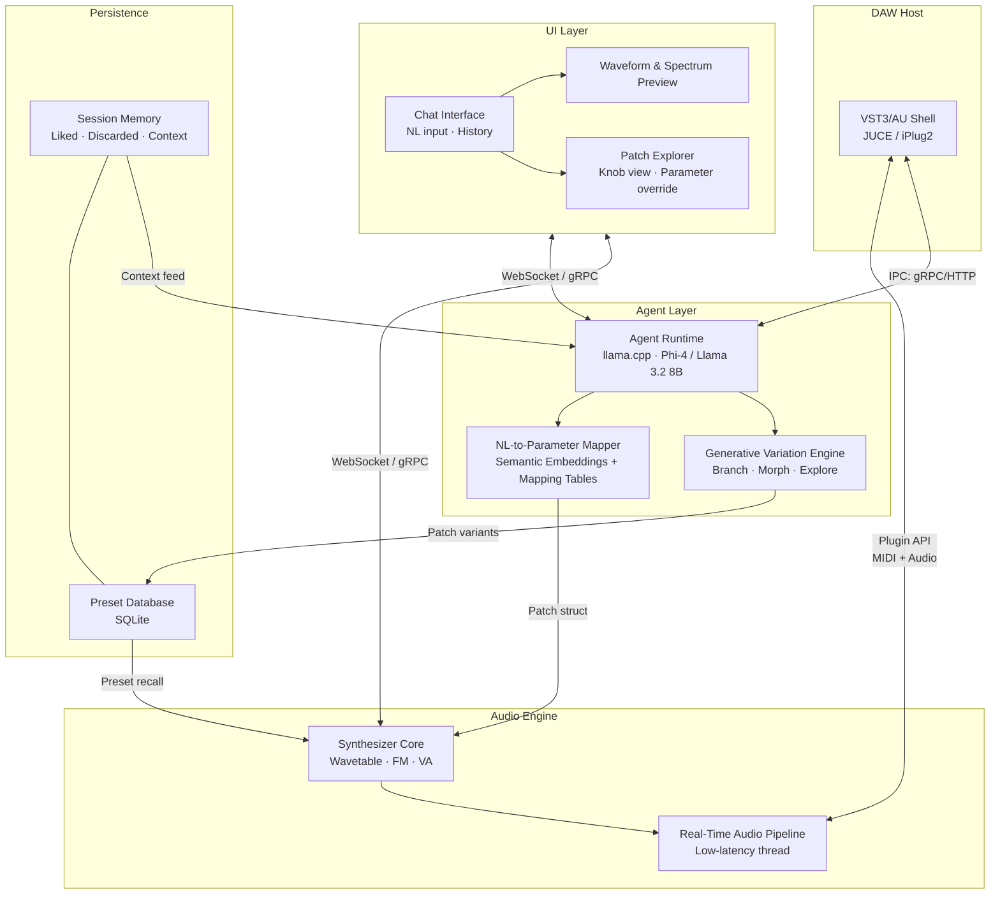

# Agentic Synth — High-Level Architecture

## 1. Overview

Agentic Synth is a VST3/AU plugin and companion desktop application that lets music producers describe sounds in natural language and receive synthesizer patches in real time. A producer speaks or types a description — "a dark, ominous bass with rhythmic earthquake-like vibrations building to a crescendo" — and an on-device AI agent translates that intent into oscillator configurations, filter settings, envelopes, and LFO routing, then renders the patch immediately for playback.

**Core value proposition:** Close the gap between sonic imagination and patch creation. No manual parameter hunting. The agent understands musical semantics, remembers what sounds the producer liked, generates variations on demand, and adjusts coherently when the producer says "make it wider" or "more aggressive in the mids."

---

## 2. System Architecture Diagram



---

## 3. Component Descriptions

### VST3/AU Shell
- **Framework:** JUCE 7 (preferred) or iPlug2
- Exposes the plugin to any DAW via VST3 and AU APIs
- Owns the audio callback — the only component allowed to touch the real-time thread
- Bridges DAW MIDI/automation events into the audio engine
- Launches the companion app process and communicates via local gRPC or named pipe

### Synthesizer Engine
- **Architecture:** Hybrid wavetable + FM + virtual-analog (VA) core, written in C++
- Wavetable layer: supports up to 256-sample wavetables, morphable across dimensions
- FM layer: 4–6 operator FM with arbitrary algorithm routing
- VA layer: Moog-ladder and SVF filter models, analog-drift oscillators
- All DSP runs lock-free on the audio thread; parameter changes are applied via atomic double-buffered structs

### Agent Runtime
- **Inference:** llama.cpp (GGUF quantized models, CPU + Metal/CUDA offload)
- **Models:** Phi-4 (14B, Q4_K_M ~8GB VRAM) or Llama 3.2 8B (Q4_K_M ~5GB) depending on available hardware
- Runs in a separate process or thread pool, never on the audio thread
- Exposes a local gRPC service with two primary endpoints: `GeneratePatch(description)` and `RefinePatch(existing_patch, delta_description)`
- Context window used to carry session history and curated synth-domain system prompt

### NL-to-Synth-Parameter Mapper
- The core glue layer — converts agent output into concrete synth parameters
- Agent produces a structured JSON patch spec (oscillator config, filter cutoff/resonance, ADSR values, LFO rate/depth/target, effects chain)
- Mapper resolves high-level semantic tags (`"warm"`, `"dark"`, `"evolving"`) via a curated embedding lookup table: each tag maps to a delta vector in parameter space
- Semantic embedding space trained on a dataset of labeled preset descriptions + parameter values
- Handles ambiguity resolution: "dark" in a bass context lowers filter cutoff; "dark" in a pad context also reduces high-frequency wavetable content
- Produces a `PatchStruct` sent to the synthesizer engine over a lock-free queue

### Audio Rendering Pipeline
- Runs entirely on the real-time audio thread inside the VST3/AU shell
- Reads `PatchStruct` from a wait-free single-producer / single-consumer queue (no agent writes here)
- Renders N-voice polyphony with voice stealing, pitch, velocity, and mod wheel routing
- Latency target: < 2ms parameter-to-audio from queue commit to rendered output
- Waveform preview is rendered off-thread at reduced sample rate for UI display

### UI Layer
- **Option A (recommended):** React + TypeScript frontend served from a local Vite dev server; communicates with the agent and synth via WebSocket
- **Option B:** Native JUCE UI — faster to ship, less flexible for chat/rich interaction
- Chat panel: text and speech input (Web Speech API or whisper.cpp for offline STT)
- Patch explorer: draggable knob grid mirroring the synthesizer's parameter space
- Waveform / spectrum visualization: canvas-rendered, updated via WebSocket push
- Preset browser: grid of generated and saved patches with audio preview thumbnails

### Session History & Preset Database
- SQLite database at `~/.agentic-synth/session.db`
- Tables: `patches` (JSON blob + metadata), `session_events` (liked/discarded/tweaked), `embeddings` (semantic vectors for similarity search)
- Session context fed back into the agent prompt so it knows what the producer has already tried
- Liked patches raise their semantic neighborhood in future generation; discarded patches suppress it

### Generative Variation Engine
- Given a base patch, generates N variations (default: 5) by:
  1. Sampling the agent with temperature-varied prompts ("a slightly brighter version", "more movement", etc.)
  2. Perturbing parameter vectors within semantic-preserving bounds (±15% on correlated parameter groups)
  3. Interpolating between two saved patches along a morph axis
- Variations rendered immediately for instant A/B comparison

---

## 4. Data Flow

**End-to-end: "a dark evolving pad"**

```
1. INPUT
   User types or speaks: "a dark evolving pad"
   ↓
2. STT (if speech)
   whisper.cpp transcribes audio → text string
   ↓
3. AGENT RUNTIME
   llama.cpp receives: [system prompt: synth domain context]
                       [session history: last 5 patches + feedback]
                       [user: "a dark evolving pad"]
   → Produces JSON patch spec:
     { osc1: {type: wavetable, table: "dark_pad_01", detune: 8},
       osc2: {type: VA, waveform: saw, octave: -1},
       filter: {type: SVF_LP, cutoff: 800, resonance: 0.3, env_mod: 0.6},
       env: {attack: 1200ms, decay: 400ms, sustain: 0.7, release: 2800ms},
       lfo1: {target: filter_cutoff, rate: 0.25Hz, depth: 0.4, shape: sine},
       lfo2: {target: osc1_wavetable_pos, rate: 0.08Hz, depth: 0.6},
       reverb: {size: 0.85, damp: 0.4} }
   ↓
4. NL-TO-PARAMETER MAPPER
   Semantic tags resolved: "dark" → filter cutoff bias −30%, wavetable → dark tables
   "evolving" → LFO depth +20%, slow rate, wavetable pos modulation
   Final PatchStruct assembled
   ↓
5. PATCH DELIVERY
   PatchStruct pushed to wait-free queue → audio thread reads next buffer cycle
   ↓
6. AUDIO RENDERING
   Synthesizer engine applies patch, renders audio
   Waveform preview rendered off-thread → pushed to UI via WebSocket
   ↓
7. USER HEARS PATCH (~50–200ms total latency for NL→audio)
   ↓
8. USER TWEAKS
   "Make the filter more open and add rhythmic gating"
   ↓
9. AGENT REFINEMENT
   Agent receives: [previous patch spec] + [delta description]
   → Updates only filter.cutoff (+40%), adds trem LFO on amplitude at 1/8 note sync
   ↓
10. SESSION MEMORY
    Event logged: patch_id, description, user_feedback="kept"
    Embedding stored for future similarity retrieval
```

---

## 5. Technology Choices

| Component | Choice | Rationale |
|---|---|---|
| Audio framework | **JUCE 7** (C++) | Battle-tested VST3/AU/standalone, excellent DSP utilities, large community, commercial license available |
| Agent inference | **llama.cpp** | Runs on CPU + Metal/CUDA, GGUF quantization, active development, proven real-world performance |
| LLM model | **Phi-4 (14B Q4)** or **Llama 3.2 8B Q4** | Phi-4 best-in-class at instruction following for its size; Llama 3.2 8B for lower-RAM systems. Both run at acceptable tokens/sec on 2022+ hardware |
| Parameter mapping | **Semantic embeddings + curated tables** | Pure LLM output is noisy for precise parameter values; curated tables provide guardrails while embeddings handle open-ended vocabulary |
| UI | **React + TypeScript + Vite + WebSocket** | Richer chat UX than native JUCE, easier to iterate on, ships to companion app and web preview simultaneously |
| IPC | **gRPC (local)** | Type-safe, low overhead, bidirectional streaming for real-time parameter updates; HTTP/JSON fallback for simpler integrations |
| Persistence | **SQLite** | Zero-dependency, embedded, sufficient for preset + session data at this scale |
| Speech input | **whisper.cpp** (offline) | Privacy-first, no API cost, runs on-device alongside llama.cpp |

---

## 6. Key Risks & Mitigations

### Real-Time Audio Safety
**Risk:** Agent inference (100ms–2s) blocks or starves the audio thread, causing dropouts.
**Mitigation:** Agent runs in a completely separate process/thread. Audio thread only reads from a wait-free queue. Parameter changes are double-buffered and applied atomically. Agent is never on the audio call stack.

### Harmful Frequency Generation
**Risk:** Agent generates extreme parameter values (e.g. 0Hz filter, full resonance self-oscillation, DC offset).
**Mitigation:** All parameter values are clamped server-side in the Mapper before reaching the synthesizer. Hard limits enforced in the `PatchStruct` validator. Resonance capped below self-oscillation threshold unless explicitly unlocked in settings.

### NL Inference Latency
**Risk:** 2–5 second lag before producer hears a patch change breaks creative flow.
**Mitigation:**
- Phi-4 Q4 produces ~15–30 tokens/sec on M2 Mac; patch JSON is ~150 tokens → ~5–10s cold. Optimized with:
  - Persistent KV cache (model stays loaded)
  - Speculative decoding where supported
  - Streaming: audio engine applies partial patch as tokens arrive, updates incrementally
  - "Instant preview" mode: mapper applies a heuristic pre-patch from keywords in < 200ms while full inference completes in background

### Semantic Ambiguity
**Risk:** "Dark" means different things across synthesis contexts, genres, and users.
**Mitigation:**
- System prompt includes synthesis-domain context grounding the model's vocabulary
- Session history disambiguates: if producer consistently pushes filter cutoff up after "dark" patches, the mapper biases future "dark" predictions
- Explicit disambiguation: agent asks a single clarifying question if confidence is low
- User-editable semantic dictionary: producers can define what "dark" means for their workflow

---

## 7. Implementation Phases

### Phase 1 — Standalone Desktop App (Foundation)
**Goal:** Prove the core loop works end-to-end without DAW complexity.

- JUCE standalone app with wavetable + VA synthesizer core
- Hardcoded patch mapping: fixed vocabulary of ~50 semantic descriptors → parameter presets
- Basic React UI with text input and patch knob display
- SQLite preset storage
- No LLM — heuristic rule-based NL parsing (keyword matching)

**Deliverable:** Producer can type 20–30 common descriptors and hear a reasonable patch.

---

### Phase 2 — Local LLM Integration + Chat Interface
**Goal:** Replace hardcoded rules with a real generative agent.

- Integrate llama.cpp with Phi-4 or Llama 3.2 8B
- Build NL-to-Parameter Mapper with semantic embedding lookup
- gRPC bridge between agent process and synth engine
- Chat interface with history, streaming responses
- Generative variation engine (5 variations from base patch)
- Session memory: liked/discarded patch tracking

**Deliverable:** Full NL patch generation loop with session awareness and variations.

---

### Phase 3 — VST3/AU Plugin + DAW Hosting
**Goal:** Run inside real DAWs (Ableton, Logic, FL Studio, Reaper).

- JUCE VST3/AU wrapper around the synthesizer core
- Plugin ↔ companion app IPC (named pipe or local gRPC)
- MIDI input handling (pitch, velocity, mod wheel, automation)
- State save/restore (DAW project serialization)
- Audio preview streaming from plugin to companion app UI
- Hardened real-time safety audit

**Deliverable:** Plugin passes basic DAW validation; runs stably in Ableton Live and Logic Pro.

---

### Phase 4 — Advanced Agentic Features
**Goal:** Make the agent a genuine creative collaborator, not just a patch generator.

- **Style transfer:** "Make this patch sound like [reference patch]" — analyzes parameter deltas and applies them
- **Session-aware generation:** Agent understands the full session narrative ("we've been building a dark set, this should be the peak moment")
- **Smart morphing:** Real-time interpolation between two patches, driven by MIDI CC or automation
- **Multi-modal input:** Hum a melody or tap a rhythm — agent infers timbre intent from audio character
- **Collaborative iteration:** Agent proactively suggests variations when producer loops a section multiple times without changing the patch
- **Export and sharing:** Export patches as standard preset formats (Serum, Vital compatible where possible)

**Deliverable:** A creative tool that feels like having a sound designer in the session.
