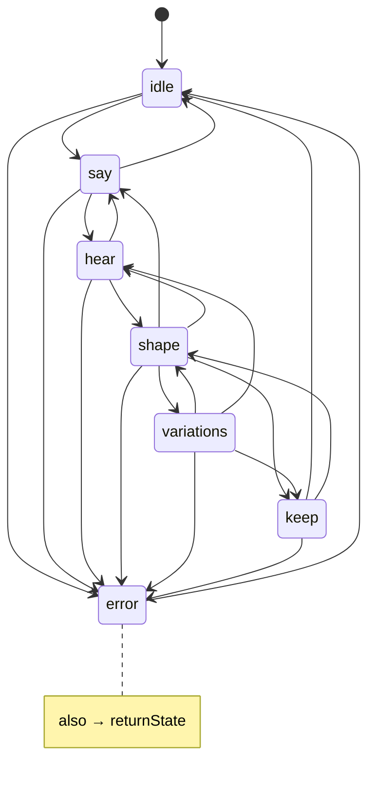

# Mobile state machine

> **v1/prototype** · Part of epic [#290](https://github.com/saman-mb/agentic-synth/issues/290) · Macros [#296](https://github.com/saman-mb/agentic-synth/issues/296) · Input [input.md](./input.md) ([#297](https://github.com/saman-mb/agentic-synth/issues/297)) · Feeds [#298](https://github.com/saman-mb/agentic-synth/issues/298) · Unblocks E5 [#294](https://github.com/saman-mb/agentic-synth/issues/294) · Closes [#295](https://github.com/saman-mb/agentic-synth/issues/295) AC.

Canonical product phases for the single mobile surface. Sheet contents are owned by [ia.md](./ia.md); this doc owns transitions and interrupts. Index: [README](./README.md). Cuts: [cut-list.md](./cut-list.md).

Captain / UX sign-off: [#295 comment](https://github.com/saman-mb/agentic-synth/issues/295#issuecomment-5480709622).

## Canonical type

**`MobileState`** — string enum. Exactly one live state. The bottom sheet is presentation of that state, not a second FSM.

| `MobileState` | Product phase | Role |
|---|---|---|
| `idle` | — | Cold start / post-Keep success. No in-flight agent. Prompt empty or last-kept summary only. |
| `say` | Say | Capturing intent (voice or text). No new patch commit yet. |
| `hear` | Hear | Agent in flight and/or first audition of landed patch. Audio may auto-preview. |
| `shape` | Shape | User thumbs macros / play. Working patch is current. |
| `variations` | Variations | Browse / request more variants; select one → becomes current. |
| `keep` | Keep | Name + confirm persist. Transient; success → `idle`. |
| `error` | — | Recoverable failure overlay/sheet. Remembers `returnState`. |

**Terminal:** none sticky. Soft terminals are Keep success (`→ idle`) and Error dismiss.

## Legal transitions

```
idle        → say | error
say         → hear | idle | error          # cancel/clear → idle
hear        → shape | error | say          # regenerate / edit prompt → say
shape       → variations | keep | say | hear | error
variations  → shape | keep | hear | error  # select variant → shape; more → hear
keep        → idle | shape | error         # cancel → shape; success → idle
error       → returnState | idle           # dismiss / retry
```

**Forbidden:** `say` ↛ `shape` on first generate (must pass through `hear`).

**Allowed:** `shape` → `say` (new idea). Variations do not mutate the Keep library until `keep` confirms.



## Interrupt matrix (global)

Apply to every state unless a state subsection notes an override. Interrupts **never** invent a new `MobileState` except hard agent failure mid-`hear` → `error`.

| Interrupt | Audio | Mic / Say | SM state | Sheet | UI |
|---|---|---|---|---|---|
| Incoming call / audio focus loss | Pause / release focus | Abort capture → stay `say` with draft text if any; else remain | **Freeze** (no auto-advance) | Preserve open/closed | Banner: “Paused” |
| App background | Pause | Same as call | **Freeze**; persist draft prompt + `MobileState` + current patch id in session scratch | Preserve | — |
| Foreground resume | Do **not** auto-play until explicit tap | Restore draft | Resume frozen state | Restore | One-tap “Resume / Play” |
| Rotation / resize | Unchanged | Unchanged | **No transition** | Preserve open/closed | Reflow only |
| Agent failure mid-`hear` | Stop preview | — | → `error` (`returnState=say`, or `shape` if a patch already exists) | Error body | Retry / Edit |

Session scratch fields: see [ia.md §Keep / session scratch](./ia.md#session-scratch-not-the-keep-library).

---

## Per-state: entry, exit, audio, sheet, interrupts

### `idle`

| | |
|---|---|
| **Entry** | App cold start; or Keep confirm succeeded; or Error dismissed to idle with no recoverable work |
| **Exit** | → `say` when user activates `el.input_cta` / starts voice or text; → `error` on unrecoverable boot / audio-route failure |
| **Audio** | Silent unless user opens a kept preset and taps `el.play` |
| **Sheet** | `sheet.idle` — collapsed or peek ([ia.md](./ia.md#idle--sheetidle)) |
| **Interrupts** | Call / background: freeze in `idle`, pause if playing. Resume: no auto-play. Rotation: reflow only |

### `say`

| | |
|---|---|
| **Entry** | User starts Say from `idle` or `shape` (new idea / edit prompt); or returns from `hear` to edit |
| **Exit** | → `hear` on Send / generate; → `idle` on Cancel / clear with no pending patch intent; → `error` on **input subsystem crash** only — ordinary mic **deny** stays in `say` with text fallback ([input.md](./input.md)) |
| **Audio** | No new patch audition yet. Duck or pause any prior preview when capture starts |
| **Sheet** | `sheet.say` — expanded ([ia.md](./ia.md#say--sheetsay)) |
| **Interrupts** | Call / background: abort capture, keep draft text, freeze in `say`. Resume: restore draft; do not auto-send. Rotation: preserve sheet expanded |

### `hear`

| | |
|---|---|
| **Entry** | Generate started from `say`; or “More” variations requested from `variations`; or regenerate from `shape` |
| **Exit** | → `shape` when patch lands and first listen settles (or user takes over); → `say` on Cancel / edit prompt; → `error` on agent / network hard failure |
| **Audio** | May auto-preview once when patch lands; pause on any focus loss |
| **Sheet** | `sheet.hear` — peek or expanded ([ia.md](./ia.md#hear--sheethear)) |
| **Interrupts** | Call / background: freeze; cancel or pause in-flight request per client policy but **do not** auto-advance; persist request id in scratch. Resume: show Resume / Play; do not auto-play. Agent failure: → `error`. Rotation: reflow only |

### `shape`

| | |
|---|---|
| **Entry** | Hear completed; or variation selected; or Keep cancelled; or Error returned with `returnState=shape` |
| **Exit** | → `variations` on Variations action; → `keep` on Keep; → `say` on new / edit prompt; → `hear` on regenerate; → `error` on play/engine hard failure |
| **Audio** | User-driven via `el.play` / gate; macros live on `el.macros` |
| **Sheet** | `sheet.shape` — peek ([ia.md](./ia.md#shape--sheetshape)) |
| **Interrupts** | Call / background: pause audio, freeze in `shape`, keep working patch in scratch. Resume: no auto-play. Rotation: reflow; macros stay mounted |

### `variations`

| | |
|---|---|
| **Entry** | User opens Variations from `shape` |
| **Exit** | → `shape` on Select or Back; → `keep` if Keep offered on selected variant; → `hear` on More; → `error` on batch failure |
| **Audio** | Preview selected / focused variant on explicit play (or light auto-preview of focused card — implementation choice; never background-auto on resume) |
| **Sheet** | `sheet.variations` — expanded ([ia.md](./ia.md#variations--sheetvariations)) |
| **Interrupts** | Call / background: pause, freeze, keep variant list + selection index in scratch. Resume: no auto-play. Rotation: preserve carousel position |

### `keep`

| | |
|---|---|
| **Entry** | User confirms intent to save from `shape` or `variations` |
| **Exit** | → `idle` on successful Confirm (preferred); → `shape` on Cancel; → `error` on write failure |
| **Audio** | May continue last audition; pause on focus loss |
| **Sheet** | `sheet.keep` — expanded ([ia.md](./ia.md#keep--sheetkeep)) |
| **Interrupts** | Call / background: freeze in `keep`, preserve name field draft in scratch. Resume: restore name draft; do not auto-confirm. Rotation: preserve expanded sheet |

Persistence fields: [ia.md §Keep persistence](./ia.md#keep-persistence-contract).

### `error`

| | |
|---|---|
| **Entry** | Recoverable failure from any state; stores `returnState` (usually `say` or `shape`) |
| **Exit** | → `returnState` on Retry / Edit success path; → `idle` on Dismiss when no useful return; Retry may re-enter `hear` via `say`/`shape` edges |
| **Audio** | Stop preview |
| **Sheet** | `sheet.error` — expanded ([ia.md](./ia.md#error--sheeterror)) |
| **Interrupts** | Call / background: freeze in `error`, preserve cause + `returnState`. Resume: stay on error sheet. Rotation: reflow only |

User-facing error classes stay small (~5): mic unavailable, network / agent, empty prompt, save failed, generic “Something went wrong”. Map the rest to generic.

## Invariants

1. First generate always `say` → `hear` → `shape` (never skip `hear`).
2. Keep library writes only on Confirm in `keep`.
3. Interrupts freeze; they do not invent states except `hear` → `error` on hard failure.
4. Foreground resume never auto-plays.
5. Rotation never changes `MobileState`.

## See also

- [IA / sheet inventory](./ia.md)
- [Cut-list](./cut-list.md)
- [Mobile docs index](./README.md)
